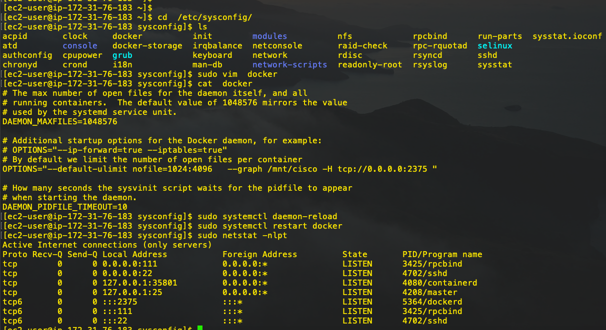
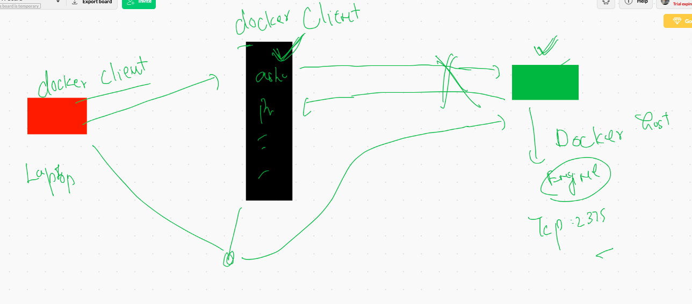

# Docker Socket 

##  Unix Socket -- can't connect. docker engine from Remote Client 

## Configure Docker engine as Tcp socket 




## Docker client / jump server client 



## Connecting from Mac & Linux client host 

```
export DOCKER_HOST="tcp://DockerHost:2375"

```

