# Docker getting started 

## DNS understanding 

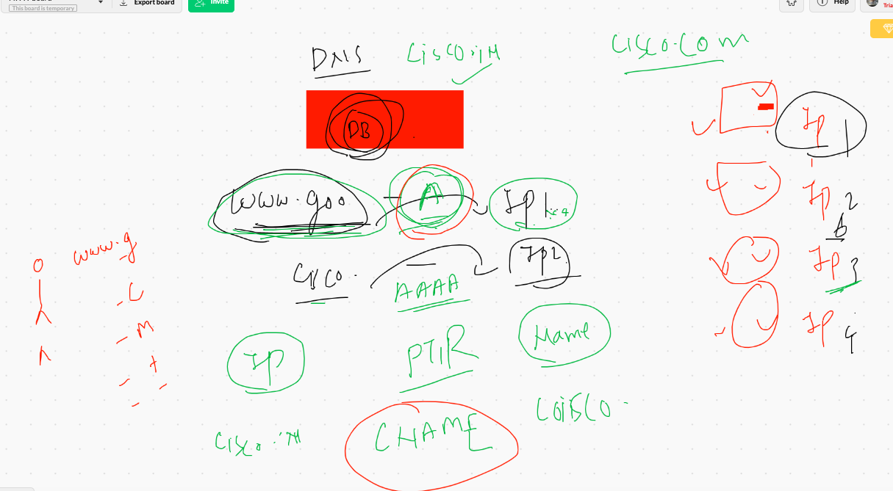

## VMS understanding 

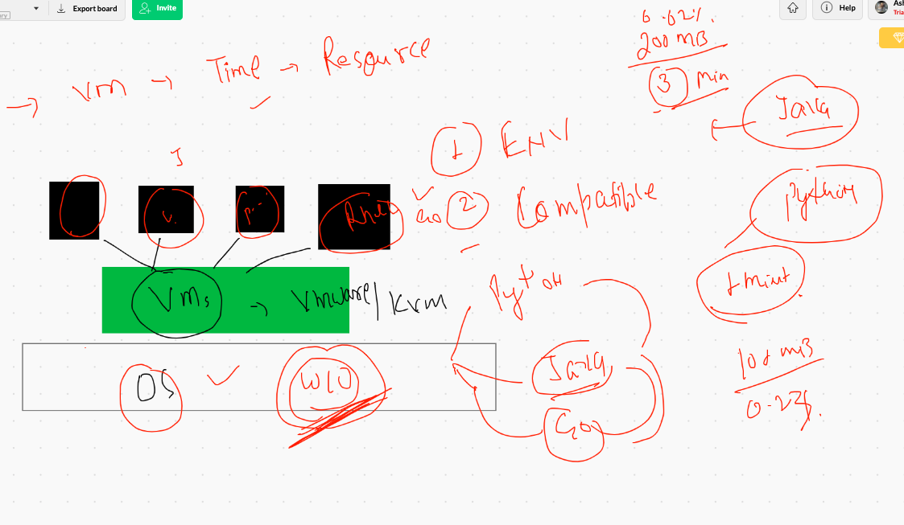

## VM vs Containers

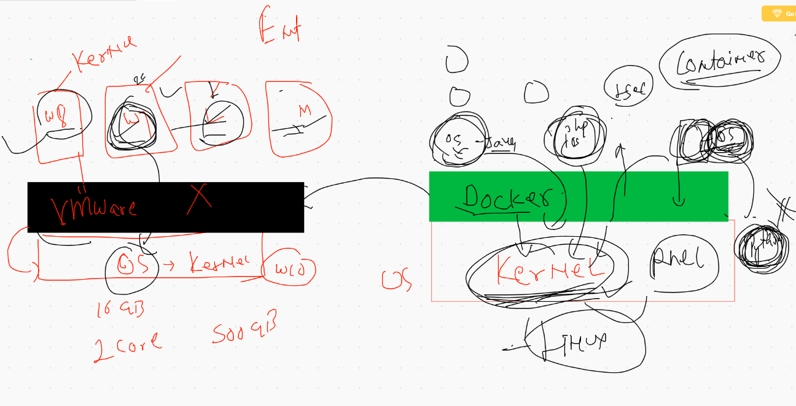

# OPtions for using containers

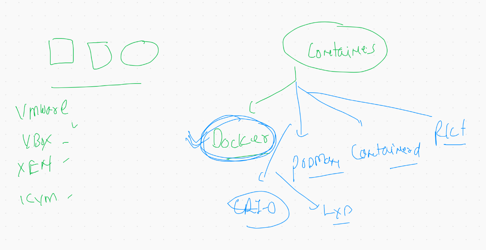

## Install docker 

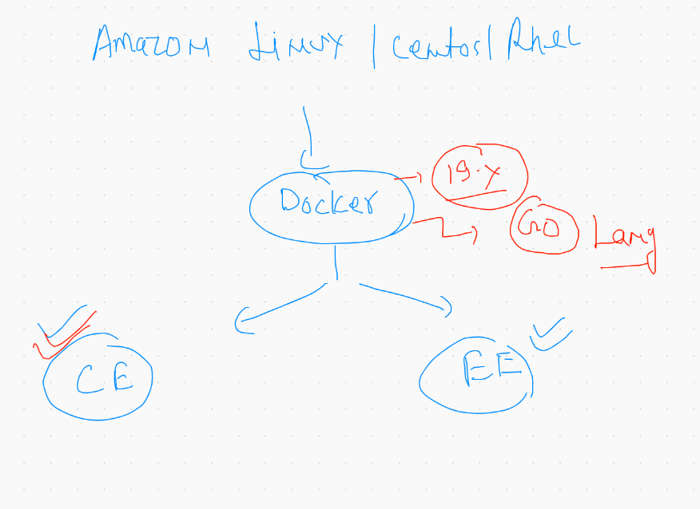

## Docker Desktop concept 

[Docker Desktop for mac ]  ('https://hub.docker.com/editions/community/docker-ce-desktop-mac')

===
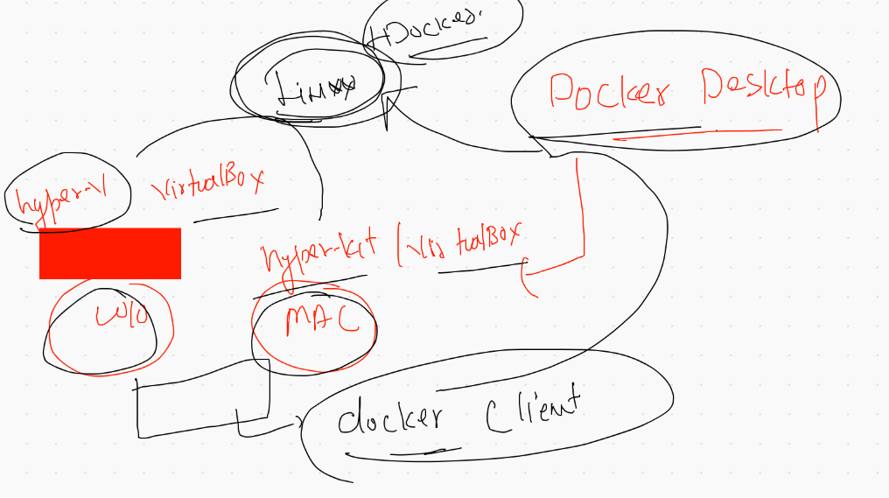

## Install and start Docker application engine in amazon linux


```
   6  rpm  -q   docker
    7  whoami
    8  sudo  yum  install  docker 
    9  history 
   10  rpm  -q  docker 
   11  docker  version 
   12  sudo  systemctl   start  docker 
   13  sudo  systemctl   status  docker 
```


===

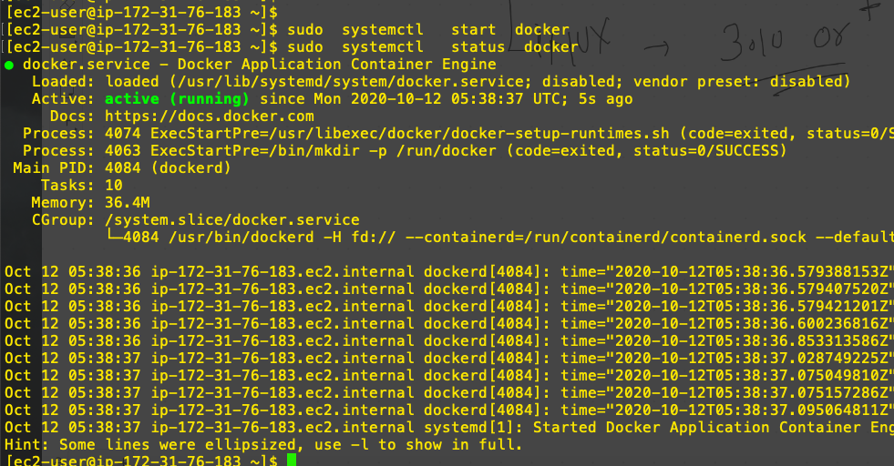

# Docker architecture 


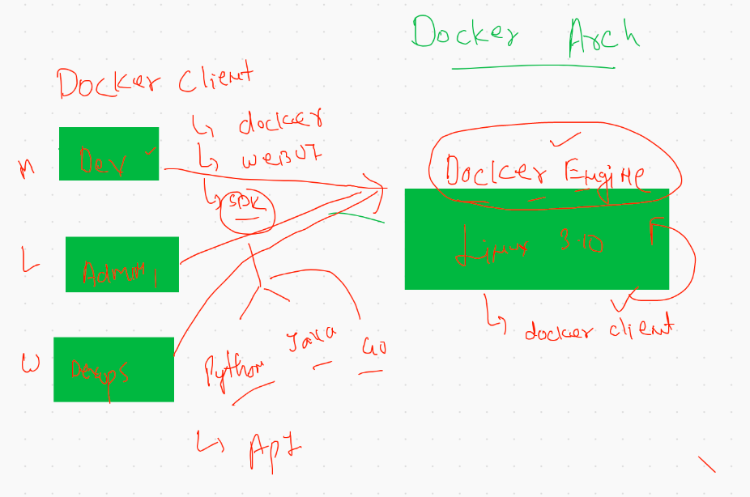


## Docker image operations 

```
 21  sudo  docker  version 
   22  sudo docker  search  java 
   23  sudo docker  search  python 
   24  sudo docker  search  mysql 
   25  history 
   26  sudo docker  images 
   27  sudo docker  pull  java 
   28  sudo docker  pull  python 
   29  sudo docker  pull  centos 
   30  history 
   31  sudo docker  images
   32  sudo docker  info 
   33  cd  /var/lib/docker
   34  ls
   35  sudo ls 
   36  cd
   37  sudo docker  pull mysql:5.7 
   38  sudo  docker  images
   39  sudo  docker  pull  alpine 
   40  sudo  docker  pull  busybox 
   41  sudo  docker  images
   42  history 
```

## creating a container

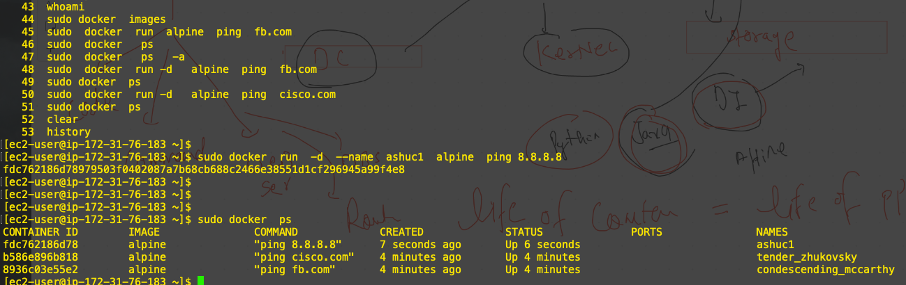

## checking output of parent process

```
sudo docker  logs  ashuc1
```
## some more operations 

```
 62  sudo docker  ps
   63  sudo   docker  stop   ashuc1  tender_zhukovsky  
   64  sudo docker  ps
   65  sudo docker  ps -a
   66  sudo docker  start  ashuc1
   67  sudo docker  ps 

```


## docker stop / kill and rm 
```
  71  sudo docker  stop   ashuc1
   72  sudo docker  start   ashuc1
   73  sudo docker  ps
   74  sudo docker  kill  ashuc1 
   75  sudo docker  ps -a
   76  clear
   77  sudo docker  ps
   78  sudo docker  ps -a
   79  sudo docker  start  ashuc1
   80  sudo docker  ps
   81  sudo docker  ps -a
   82  sudo docker  rm  b586e896b818   recursing_cannon 
   83  sudo docker  ps -a
   84  sudo docker  ps

```

## Docker child 

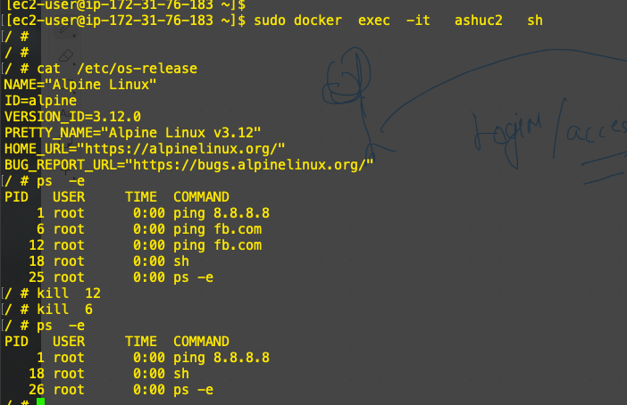

# Create custom docker images

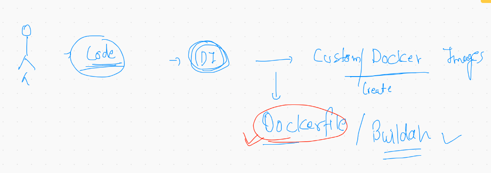


## Building docker image from dockerfile 


```
docker build -t  python:ashuv1 .

```

## checking output 

```
 sudo docker run  -itd  --name  ashupyc1 python:ashuv1
 
  183  sudo docker  logs  ashupyc1 
  184  sudo docker  logs -f  ashupyc1 
```


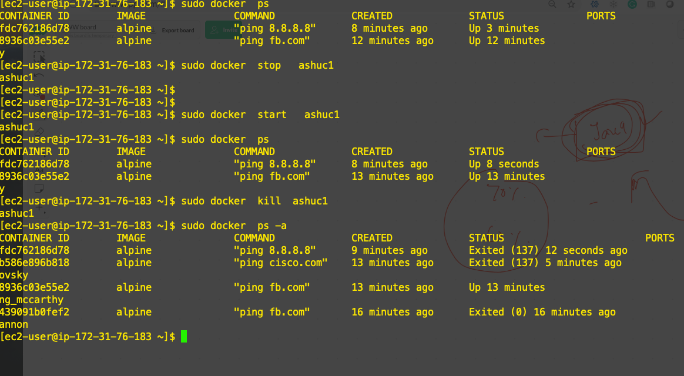


# Web server as open source

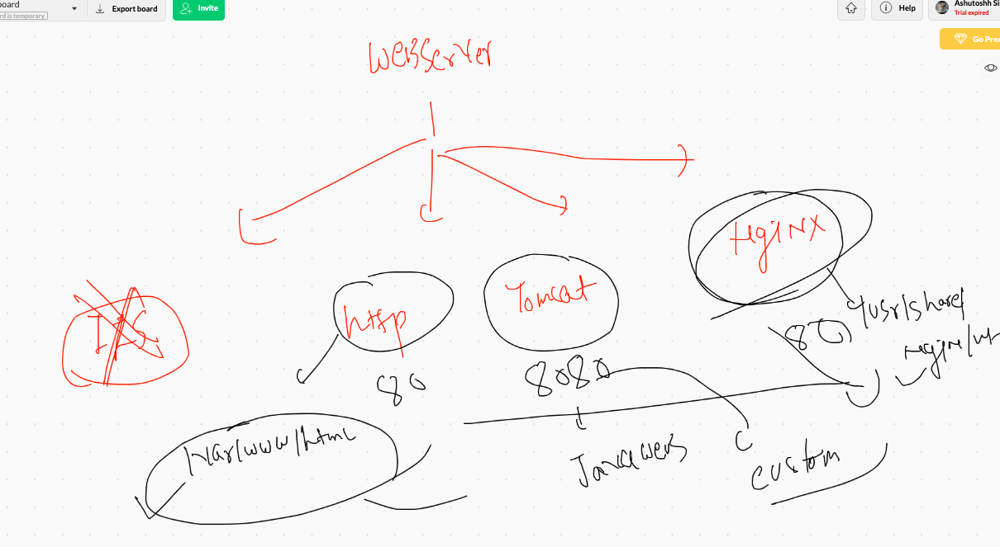

## building nginx docker image

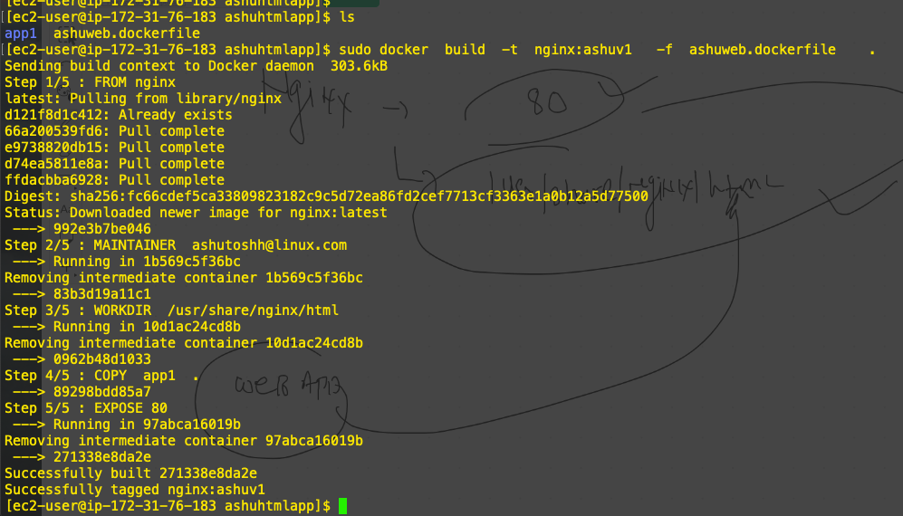

## nginx container creation 

```
 sudo docker run -itd --name  ashuw1 -p  3322:80    nginx:ashuv1 
 [ec2-user@ip-172-31-76-183 ashuhtmlapp]$ sudo docker ps
CONTAINER ID        IMAGE               COMMAND                  CREATED             STATUS              PORTS                  NAMES
8959ff734c0f        nginx:ashuv1        "/docker-entrypoint.…"   3 minutes ago       Up 3 minutes        0.0.0.0:3322->80/tcp   ashuw1

```

## kill and remove all the containers

```
 249  sudo docker kill  $(sudo  docker   ps  -q)
  250  sudo docker  ps
  251  sudo docker rm   $(sudo  docker   ps  -aq)
```

## systemd problem in docker  container 

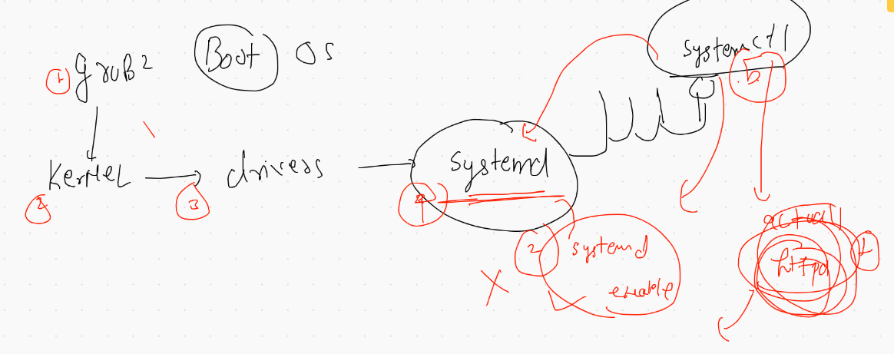


## create container and access it from any where

```
[ec2-user@ip-172-31-76-183 ashuhttpdinstall]$ sudo docker  run  -d  --name myapp -p 1234:80 http:v001  
b38d7a029b4131c8b8e4976a7e84c9227eacc5621dbaa3e79b3bd1556c5d901f
[ec2-user@ip-172-31-76-183 ashuhttpdinstall]$ sudo docker  ps
CONTAINER ID        IMAGE               COMMAND                  CREATED             STATUS              PORTS                  NAMES
b38d7a029b41        http:v001           "/bin/sh -c '/usr/sb…"   4 seconds ago       Up 4 seconds        0.0.0.0:1234->80/tcp   myapp
[ec2-user@ip-172-31-76-183 ashuhttpdinstall]$ curl https://ipinfo.io/json 
{
  "ip": "18.206.238.0",
  "hostname": "ec2-18-206-238-0.compute-1.amazonaws.com",
  "city": "Virginia Beach",
  "region": "Virginia",
  "country": "US",
  "loc": "36.7957,-76.0126",
  "org": "AS14618 Amazon.com, Inc.",
  "postal": "23471",

```

