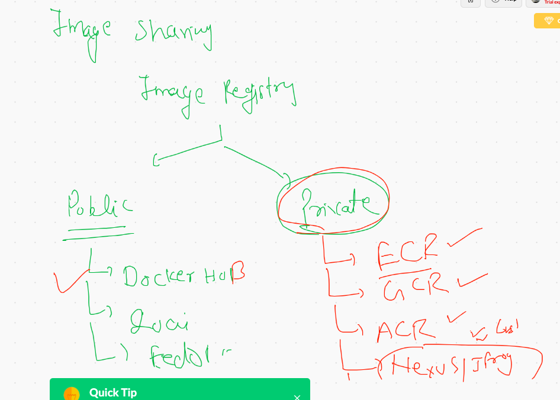

# CRE 


## namespace and cgroups in containers by Docker 


## Docker access by a non root user  troubleshooting 


## checking resource consumption of containers


## Restricting RAM in container 

```
 docker  run -d --name ashuc2  --memory 400M  alpine ping google.co
 
```

## Restricting CPu in containers

```
  423  docker run -d --name ashuc3  --cpu-shares 60  alpine ping fb.com 
  424  docker run -d --name ashuc4 --cpuset-cpus=1   --cpu-shares 60  alpine ping fb.com 
```

## Link for resource management 

[Ram and CPU] ('https://docs.docker.com/config/containers/resource_constraints/')


# Dockerfile with Multiapp 


## after building 

```
599  docker  run -d --name ashuc2  -p 9999:80  -e x=project1  ciscowebapp:12102020  
  600  docker  run -d --name ashuc3  -p 9991:80  -e x=project2  ciscowebapp:12102020  
  601  docker  ps
  602  curl https://ipinfo.io/json 
  603  docker  run -d --name ashuc4  -p 9992:80  -e x=project3  ciscowebapp:12102020  
  604  docker  ps

```

# Docker image registires 



## image name reality 


# Docker Networking 

##  port forwarding 


## Docker network types 


## Custom bridge 


## Docker network history 

```
 633  docker network  ls
  634  docker  network inspect  bridge 
  636  docker network  ls
  637  docker  network inspect  bridge 
  640  docker  network inspect  bridge 
  642  docker network  ls
  643  docker run  -d  --name ashuc3 --network  none  alpine ping 127.0.0.1  
  646  docker network  ls
  649  docker run -it --rm  --network host alpine sh 
  651  docker network  ls
  654  docker network ls
  655  docker  network  create   ashubr1 
  656  docker network ls
  657  docker  network  create   ashubr2  --subnet  192.168.0.0/16 
  658  docker network ls
  659  docker network inspect  ashubr1  
  660  docker network inspect  ashubr2  
  664  docker network ls
  668  docker run -d  --name x3 --network ashubr1  alpine ping fb.com 
  669  docker run -d  --name x4 --network ashubr1  alpine ping fb.com 
  678  docker run  -d --name x5 alpine  --network ashubr2  ping fb.com 
  679  docker run  -d --name x5   --network ashubr2 alpine  ping fb.com 
  680  docker run  -d --name x6   --network ashubr2 alpine  ping fb.com 
  682  docker run  -d --name x7   --network ashubr2  --ip 192.168.100.200    alpine  ping fb.com 
  
  ```
  
  ## across the bridge connection 
  
  ```
   688  docker  exec -it x3  sh 
  689  docker  network connect  
  690  docker  network connect  ashubr2  x3
  691  docker  exec -it x3  sh 
  692  history 
  693  docker  network disconnect  ashubr2  x3
  694  docker  exec -it x3  sh 

```


## Removing bridges


## Container networking models


## Container network drivers 


[docker macvlan] ('https://docs.docker.com/network/macvlan/')


## Macvlan 


## Swarm with overlay network drivers


