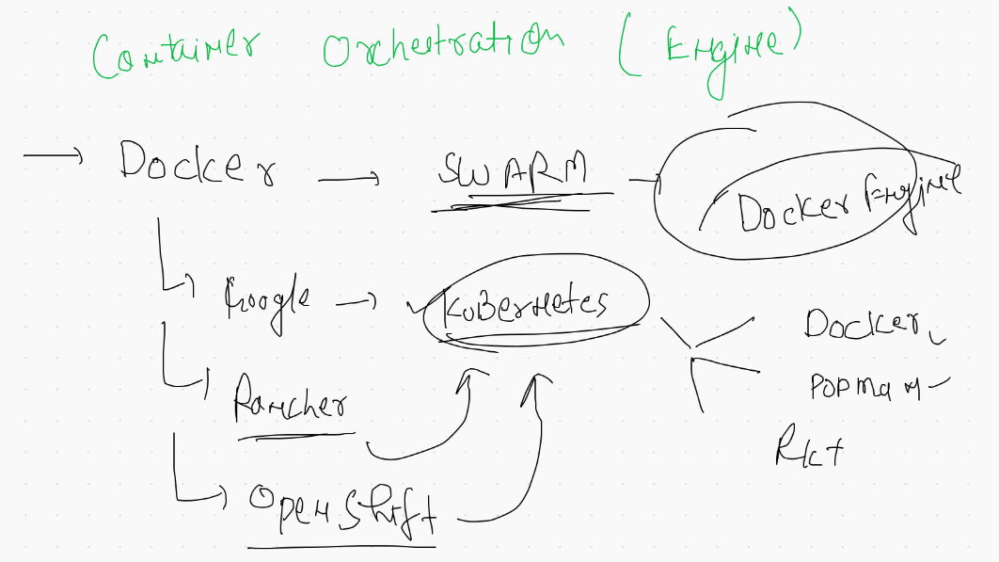

# Docker Socket 

##  Unix Socket -- can't connect. docker engine from Remote Client 

## Configure Docker engine as Tcp socket 


## Docker client / jump server client 


## Connecting from Mac & Linux client host 

```
export DOCKER_HOST="tcp://DockerHost:2375"

```

## More On docker volumes 

```
 808  docker  volume  ls
  809  docker  volume  inspect  ashuvol1 
  810  docker run -rm -it   -v  ashuvol1:/data   alpine  sh 
  811  docker run --rm -it   -v  ashuvol1:/data   alpine  sh 
  812  docker run --rm -it   -v  ashuvol1:/data:ro    alpine  sh 
  813  history 
  814  docker run --rm -it   -v  ashuvol1:/data:ro  -v  ashuvol2:/data1:rw      alpine  sh 
  815  docker  volume  ls
  816  docker  volume inspect  ashuvol2
  817  ls
  818  pwd
  819  docker run -d  --name web1  -p 1244:80 -v  /home/ec2-user/ashuapp1:/usr/share/nginx/html  nginx 
  820  docker  ps
  821  history 
  822  docker  ps
  823  docker  rm $(docker ps -aq) -f
  824  docker  volume  rm $(docker volume ls -q)
  825  docker  volume  ls

```

# Docker Web UI 

[portainer] ('https://www.portainer.io/')

===
[kitematic] ('https://kitematic.com/')

==

[Rancher] ('https://kitematic.com/')

## Docker WebUI with Portainer 


```
 832  docker run -d  --name mywebui --restart always -p 9000:9000  -v /var/run/docker.sock:/var/run/docker.sock portainer/portainer 
  833  history 
  834  docker  ps
  835  docker  logs mywebui 
  
  ```

# Container Orchestraion engine 



## K8s arch 


## k8s worker side


# k8s cluster Deployment 


## Installation  of k8s cluster using kubeadm 

## things to be install on master and minion both

```
[root@ip-172-31-78-86 ~]# cat  setup.sh 
modprobe br_netfilter  #  to install and use CNI we need to enable kernel support
echo '1' > /proc/sys/net/bridge/bridge-nf-call-iptables   #  for kube proxy support 
swapoff  -a  #  not supported by kubeadm 
cat  <<EOF  >/etc/yum.repos.d/kube.repo
[kube]
baseurl=https://packages.cloud.google.com/yum/repos/kubernetes-el7-x86_64
gpgcheck=0
EOF

yum  install  docker  kubeadm  -y
systemctl enable  --now  docker  kubelet 

```

## K8s installaion on any cloud  / vm

[k8s install] ('https://github.com/redashu/k8s')

