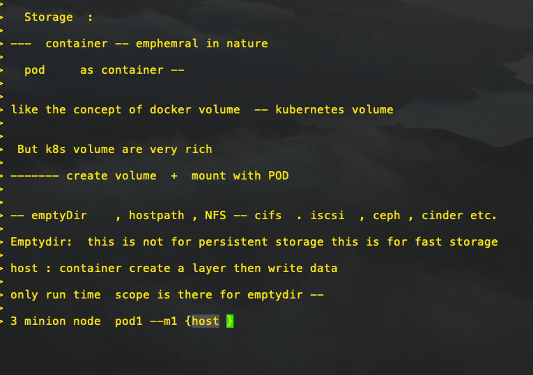

# Docker compose ideas


## Learning link 

[ashutoshh github]  ('https://github.com/redashu/docker-compose')


# Load Balancer service in k8s

# Storage in k8s 

## volumes plugings 

[volume link]  ('https://kubernetes.io/docs/concepts/storage/volumes/')


## Delete all things 

```
ashutoshhs-MacBook-Air:myapps fire$ kubectl  delete  all --all -n ashu-space 
pod "ashumultidep-8c659d8b4-7n4cs" deleted
pod "ashumultidep-8c659d8b4-9b4tm" deleted
pod "ashumultidep-8c659d8b4-svct8" deleted
pod "ashumultidep-8c659d8b4-xp6kk" deleted
pod "ashumultidep-8c659d8b4-zqkvg" deleted
service "ashumultidep" deleted
deployment.apps "ashumultidep" deleted
ashutoshhs-MacBook-Air:myapps fire$ 
ashutoshhs-MacBook-Air:myapps fire$ kubectl get  all -n ashu-space 
NAME                               READY   STATUS        RESTARTS   AGE
pod/ashumultidep-8c659d8b4-48zpv   1/1     Terminating   0          55s
pod/ashumultidep-8c659d8b4-5477c   1/1     Terminating   0          56s
pod/ashumultidep-8c659d8b4-8zs2j   1/1     Terminating   0          56s
pod/ashumultidep-8c659d8b4-cgc86   1/1     Terminating   0          55s
pod/ashumultidep-8c659d8b4-dh4zd   1/1     Terminating   0          55s
ashutoshhs-MacBook-Air:myapps fire$ 


```


## Implementing emptydir type 



## creating alpine pod file

```
kubectl  run  ashuemp1 --image=alpine  --dry-run -o yaml >empvol.yml

```

##

```
ashutoshhs-MacBook-Air:myapps fire$ kubectl replace  -f empvol.yml  --force 
pod "ashuemp1" deleted
pod/ashuemp1 replaced
ashutoshhs-MacBook-Air:myapps fire$ kubectl get po -n ashu-space 
NAME       READY   STATUS    RESTARTS   AGE
ashuemp1   1/1     Running   0          5s
ashutoshhs-MacBook-Air:myapps fire$ 


```

## checking logs

```
325  kubectl logs  ashuemp1  -n ashu-space 
  326  kubectl logs  ashuemp1 -f  -n ashu-space 
  
```

# Multi container pod 

```
ashutoshhs-MacBook-Air:myapps fire$ cat  multic.yml 
apiVersion: v1
kind: Pod
metadata:
  creationTimestamp: null
  labels:
    run: ashuemp1
  name: ashuemp1
  namespace: ashu-space  #  updating namespace 
spec:
  volumes:
  - name: ashuvol11 # name of volume 
    emptyDir: {} 
  containers:
  - image: nginx
    name: ashuwec1
    ports:
    - containerPort: 80 
    volumeMounts:
    - name: ashuvol11
      mountPath: /usr/share/nginx/html/


  - image: alpine
    name: ashuemp1
    command: ["/bin/sh","-c","while true;do echo 'hello <input>' >>/mnt/cisco/index.html;sleep 2;done"]
    volumeMounts:
    - name: ashuvol11 # name of volume created above 
      mountPath: /mnt/cisco # location under alpine container 

  
    resources: {}
  dnsPolicy: ClusterFirst
  restartPolicy: Always
status: {}

```

== Deplloy 

```
 350  kubectl  apply  -f multic.yml 
  351  kubectl get  po -n ashu-space 
  352  kubectl describe  pod ashuemp1  -n ashu-space 
  353  history 
  354  kubectl get  po -n ashu-space 
  355  kubectl expose  pod  ashuemp1 --type NodePort --port 1245 --target-port 80 -n ashu-space 
  356  kubectl get po --show-labels -n ashu-space 
  357  kubectl get svc -n ashu-space 
  358  cat  multic.yml 
  359  history 
ashutoshhs-MacBook-Air:myapps fire$ kubectl get svc -n ashu-space 
NAME       TYPE       CLUSTER-IP      EXTERNAL-IP   PORT(S)          AGE
ashuemp1   NodePort   10.107.112.53   <none>        1245:32688/TCP   109s
ashutoshhs-MacBook-Air:myapps fire$ kubectl get po --show-labels -n ashu-space 
NAME       READY   STATUS    RESTARTS   AGE     LABELS
ashuemp1   2/2     Running   0          3m29s   run=ashuemp1
ashutoshhs-MacBook-Air:myapps fire$ 

```


