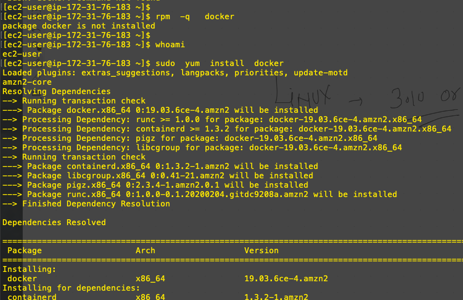

# Docker getting started 

## DNS understanding 


## VMS understanding 


## VM vs Containers


# OPtions for using containers


## Install docker 


## Docker Desktop concept 

[Docker Desktop for mac ]  ('https://hub.docker.com/editions/community/docker-ce-desktop-mac')

===


## Install and start Docker application engine in amazon linux


```
   6  rpm  -q   docker
    7  whoami
    8  sudo  yum  install  docker 
    9  history 
   10  rpm  -q  docker 
   11  docker  version 
   12  sudo  systemctl   start  docker 
   13  sudo  systemctl   status  docker 
```



===


