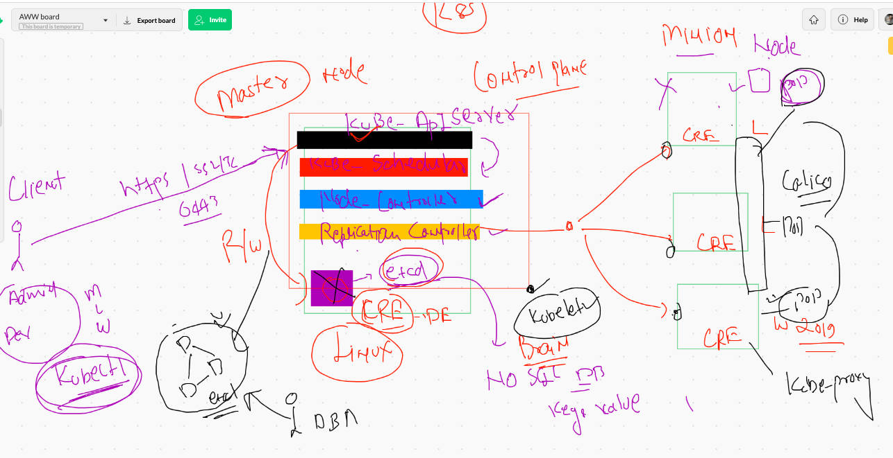
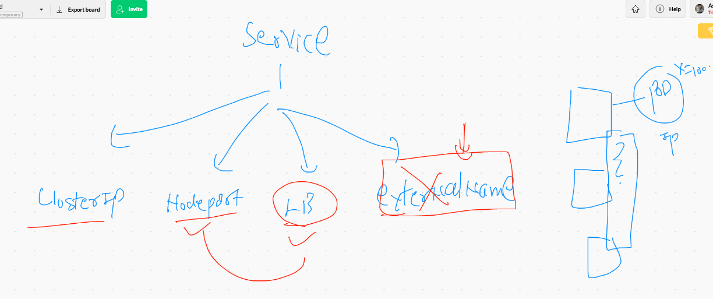

# Production grade container orchestration with K8s by Google / CNCF 

## COnfigure K8s client on Linux / MAC  /windows 


## K8s Arch Revise 



## POd creation automatically in YAML / JSON format file 

```
 510  #  docker run  --name  c1  -p 3245:80  nginx 
  511  kubectl run  ashuwebpod1  --image=nginx --port 80 
  512  kubectl  get  po 
  513  kubectl  delete   pod  ashuwebpod1 
  514  kubectl run  ashuwebpod1  --image=nginx --port 80 --dry-run  -o yaml 
  515  kubectl run  ashuwebpod1  --image=nginx --port 80 --dry-run  -o yaml  >nginxpod.yml
  516  history 
  517  kubectl run  ashuwebpod1  --image=nginx --port 80 --dry-run  -o json 
  518  kubectl run  ashuwebpod1  --image=nginx --port 80 --dry-run  -o json  >ashunginx.json 
  
```
## labels 


## checking labels of pods

```
ashutoshhs-MacBook-Air:myapps fire$ kubectl get  po --show-labels 
NAME                         READY   STATUS    RESTARTS   AGE     LABELS
ashuwebpod1                  1/1     Running   0          6m4s    run=ashuwebpod1
chandra-pod1                 1/1     Running   0          2m42s   <none>
karan-webpod1                1/1     Running   0          5m38s   run=karan-webpod1
m10-pod                      1/1     Running   0          15m     run=m10-pod
mamtapod1                    1/1     Running   0          5m57s   run=mamtapod1
mandnayapod1                 1/1     Running   0          5m45s   run=mandnayapod1

```

## access pod from k8s client machine 

# Note : it is similar to docker exec 


## accessing web app from k8s client machine 


## Overall methods to access web app deployed on K8s 


# Services in K8s 



## Example of NodePort service yaml 

```
ashutoshhs-MacBook-Air:myapps fire$ cat  ashungsvc.yml 
apiVersion: v1
kind: Service
metadata:
  creationTimestamp: null
  labels:   #  label of service and this is not used by service this is for any other k8s api whosoever want to connect svc
    app: ashusvc1
  name: ashusvc1  #  name of service 
spec:
  ports:
  - name: 1234-80  # name of servce port 
    port: 1234  #  service port that will be binded with service IP 
    protocol: TCP  
    targetPort: 80  #  port of pod running application 
  selector:   #  to find pod using labels 
    run: ashuwebpod1  # this label is same as pod label 
  type: NodePort  #  type of service we created 
status:
  loadBalancer: {}

```

## checking services

```
ashutoshhs-MacBook-Air:myapps fire$ kubectl  get  service 
NAME             TYPE        CLUSTER-IP       EXTERNAL-IP   PORT(S)          AGE
ashusvc1         NodePort    10.107.4.189     <none>        1234:32186/TCP   2m18s
karan-webpod1    NodePort    10.102.24.22     <none>        1234:30565/TCP   91s
kubernetes       ClusterIP   10.96.0.1        <none>        443/TCP          22h
mamtapod1        NodePort    10.104.108.119   <none>        1234:31218/TCP   2m14s
mandakinisrvc1   NodePort    10.106.158.203   <none>        1236:31697/TCP   26s
nm               NodePort    10.111.147.67    <none>        1234:30241/TCP   111s
sushilsc2        NodePort    10.102.159.247   <none>        1111:31025/TCP   7m23s
tansvc1          NodePort    10.97.4.202      <none>        1235:31996/TCP   9m
vipsvc1          NodePort    10.99.160.214    <none>        1234:31303/TCP   2m5s

ashutoshhs-MacBook-Air:myapps fire$ kubectl  get  svc
NAME             TYPE        CLUSTER-IP       EXTERNAL-IP   PORT(S)          AGE
ashusvc1         NodePort    10.107.4.189     <none>        1234:32186/TCP   2m24s
karan-webpod1    NodePort    10.102.24.22     <none>        1234:30565/TCP   97s
kubernetes       ClusterIP   10.96.0.1        <none>        443/TCP          22h
mamtapod1        NodePort    10.104.108.119   <none>        1234:31218/TCP   2m20s
mandakinisrvc1   NodePort    10.106.158.203   <none>        1236:31697/TCP   32s
nm               NodePort    10.111.147.67    <none>        1234:30241/TCP   117s
sushilsc2        NodePort    10.102.159.247   <none>        1111:31025/TCP   7m29s
tansvc1          NodePort    10.97.4.202      <none>        1235:31996/TCP   9m6s
vipsvc1          NodePort    10.99.160.214    <none>        1234:31303/TCP   2m11s

```

## More commands for service 
```
589  kubectl  get  service 
  590  kubectl  get  po --show-labels 
  591  kubectl  get  svc
  592  history 
  593  ¬
  594  clear
  595  kubectl  get  pod --show-labels 
  596  cat  ashungsvc.yml 
  597  ls
  598  kubectl get  svc
  599  kubectl  edit  svc  sushilsc2 
  600  ls
  601  vim ashungsvc.yml 
  602  kubectl delete  svc  ashusvc1 
  603  kubectl get  svc


```

# Namespace in K8s 

```
ashutoshhs-MacBook-Air:myapps fire$ kubectl  get namespaces 
NAME              STATUS   AGE
default           Active   23h
kube-node-lease   Active   23h
kube-public       Active   23h
kube-system       Active   23h

```

## checking all k8s component

```
ashutoshhs-MacBook-Air:myapps fire$ kubectl  get pod  --namespace  kube-system 
NAME                                                   READY   STATUS    RESTARTS   AGE
calico-kube-controllers-bcc6f659f-pbwjm                1/1     Running   1          23h
calico-node-gjwqb                                      1/1     Running   1          23h
calico-node-kllsg                                      1/1     Running   1          23h
calico-node-tr8kc                                      1/1     Running   1          23h
calico-node-wb9cw                                      1/1     Running   1          23h
coredns-f9fd979d6-8kbx7                                1/1     Running   1          23h
coredns-f9fd979d6-fcxlk                                1/1     Running   1          23h
etcd-ip-172-31-78-86.ec2.internal                      1/1     Running   1          23h
kube-apiserver-ip-172-31-78-86.ec2.internal            1/1     Running   1          23h
kube-controller-manager-ip-172-31-78-86.ec2.internal   1/1     Running   1          23h
kube-proxy-fmk7h                                       1/1     Running   1          23h
kube-proxy-hmdk6                                       1/1     Running   1          23h
kube-proxy-mxfxf                                       1/1     Running   1          23h
kube-proxy-pt9vd                                       1/1     Running   1          23h
kube-scheduler-ip-172-31-78-86.ec2.internal            1/1     Running   1          23h

```

## Points to remember a POD 

```

>  scalling of POds --  
> 
> Important: Pod can't be scaled  -- Problem 1 
> 
>   Problem 2  :  node where your pod is running is gone /down
> 
>        pod will not be deleted or reschedule it immediately 
> 
>    after pod-eviction time pod will be terminated but won't be rescheduled 
> 
> 

```

# replication Controller

```
apiVersion: v1
kind: ReplicationController
metadata:
 name: ashu-rc-1
 namespace: ashu-space
 labels:
  x: ashurc11  #  this is label of RC not label of Pod

spec:
 replicas: 2  #  no of pod for application
 template:  # RC will be using template to create PODS
  metadata:
   name: mypod1  # this will not be used so RC will give some random name 
   labels:    #  label of both the pod will be same
    x1: ashuapp11 

  spec:
   containers:
   - image: nginx
     name: ashuc1
     ports:
     - containerPort: 80
     
 ```
 
 
## Deploy and check 

```
 713  kubectl apply  -f ashurc1.yml 
  714  kubectl get  rc -n ashu-space 
  715  kubectl get  pod  -n ashu-space 
  716  cat ashurc1.yml 
  717  history 
ashutoshhs-MacBook-Air:myapps fire$ kubectl get  pod  -n ashu-space  --show-labels 
NAME              READY   STATUS    RESTARTS   AGE    LABELS
ashu-rc-1-28lp2   1/1     Running   0          100s   x1=ashuapp11
ashu-rc-1-5lqxl   1/1     Running   0          100s   x1=ashuapp11
ashutoshhs-MacBook-Air:myapps fire$ kubectl get  pod  -n ashu-space  --show-labels  -o wide
NAME              READY   STATUS    RESTARTS   AGE    IP                NODE                            NOMINATED NODE   READINESS GATES   LABELS
ashu-rc-1-28lp2   1/1     Running   0          107s   192.168.238.215   ip-172-31-73-197.ec2.internal   <none>           <none>            x1=ashuapp11
ashu-rc-1-5lqxl   1/1     Running   0          107s   192.168.219.218   ip-172-31-69-50.ec2.internal    <none>           <none>            x1=ashuapp11

```

## Expose to create service in K8s

```
kubectl expose  rc  ashu-rc-1 --port 1234 --target-port 80 --type NodePort   -n ashu-space 

```


# Deployment in k8s 

## rolling updates 


