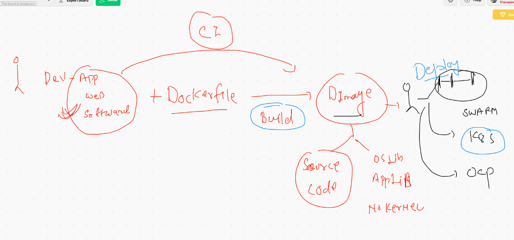

# Docker Socket 

##  Unix Socket -- can't connect. docker engine from Remote Client 

## Configure Docker engine as Tcp socket 


## Docker client / jump server client 


## Connecting from Mac & Linux client host 

```
export DOCKER_HOST="tcp://DockerHost:2375"

```

## More On docker volumes 

```
 808  docker  volume  ls
  809  docker  volume  inspect  ashuvol1 
  810  docker run -rm -it   -v  ashuvol1:/data   alpine  sh 
  811  docker run --rm -it   -v  ashuvol1:/data   alpine  sh 
  812  docker run --rm -it   -v  ashuvol1:/data:ro    alpine  sh 
  813  history 
  814  docker run --rm -it   -v  ashuvol1:/data:ro  -v  ashuvol2:/data1:rw      alpine  sh 
  815  docker  volume  ls
  816  docker  volume inspect  ashuvol2
  817  ls
  818  pwd
  819  docker run -d  --name web1  -p 1244:80 -v  /home/ec2-user/ashuapp1:/usr/share/nginx/html  nginx 
  820  docker  ps
  821  history 
  822  docker  ps
  823  docker  rm $(docker ps -aq) -f
  824  docker  volume  rm $(docker volume ls -q)
  825  docker  volume  ls

```

# Docker Web UI 

[portainer] ('https://www.portainer.io/')

===
[kitematic] ('https://kitematic.com/')

==

[Rancher] ('https://kitematic.com/')

## Docker WebUI with Portainer 


```
 832  docker run -d  --name mywebui --restart always -p 9000:9000  -v /var/run/docker.sock:/var/run/docker.sock portainer/portainer 
  833  history 
  834  docker  ps
  835  docker  logs mywebui 
  
  ```

# Container Orchestraion engine 


## K8s arch 


## k8s worker side


# k8s cluster Deployment 


## Installation  of k8s cluster using kubeadm 

## things to be install on master and minion both

```
[root@ip-172-31-78-86 ~]# cat  setup.sh 
modprobe br_netfilter  #  to install and use CNI we need to enable kernel support
echo '1' > /proc/sys/net/bridge/bridge-nf-call-iptables   #  for kube proxy support 
swapoff  -a  #  not supported by kubeadm 
cat  <<EOF  >/etc/yum.repos.d/kube.repo
[kube]
baseurl=https://packages.cloud.google.com/yum/repos/kubernetes-el7-x86_64
gpgcheck=0
EOF

yum  install  docker  kubeadm  -y
systemctl enable  --now  docker  kubelet 

```

## K8s installaion on any cloud  / vm

[k8s install] ('https://github.com/redashu/k8s')

# app Deployment model 



## Installing kubectl on LInux based clients 

```
   73  curl -LO "https://storage.googleapis.com/kubernetes-release/release/$(curl -s https://storage.googleapis.com/kubernetes-release/release/stable.txt)/bin/linux/amd64/kubectl"
   74  ls
   75  sudo mv  kubectl  /usr/bin/
   76  sudo chmod +x /usr/bin/kubectl 

```

## Kubectl installation link 

[kubectl]  ('https://kubernetes.io/docs/tasks/tools/install-kubectl/')


## checking installation 

```
[ec2-user@ip-172-31-11-42 ~]$ kubectl  version --client 
Client Version: version.Info{Major:"1", Minor:"20+", GitVersion:"v1.20.0-alpha.2", GitCommit:"ee297b6f4d78daaf2f71c78a05203698581ca40a", GitTreeState:"clean", BuildDate:"2020-10-13T18:56:04Z", GoVersion:"go1.15.2", Compiler:"gc", Platform:"linux/amd64"}

```


## Configure kubeconf file 


## Checking number of nodes in k8s cluster

```
ashutoshhs-MacBook-Air:Desktop fire$ kubectl  get  nodes 
NAME                            STATUS   ROLES    AGE    VERSION
ip-172-31-69-50.ec2.internal    Ready    <none>   120m   v1.19.2
ip-172-31-69-53.ec2.internal    Ready    <none>   120m   v1.19.2
ip-172-31-73-197.ec2.internal   Ready    <none>   120m   v1.19.2
ip-172-31-78-86.ec2.internal    Ready    master   121m   v1.19.2
ashutoshhs-MacBook-Air:Desktop fire$ 

```

## POd creation 

```
ashutoshhs-MacBook-Air:myapps fire$ cat  ashupod1.yaml 
apiVersion: v1
kind: Pod 
metadata:
 name: ashu-pod1  #  this is for name of pod 

spec:  #  this is for defining information about container 
 containers:
 - image: nginx  #  image from docker hub 
   name: ashuc1 #  name of container 
   ports:
   - containerPort: 80 

```


##  deploying pod in k8s 

```
ashutoshhs-MacBook-Air:myapps fire$ kubectl  apply  -f  ashupod1.yaml  
pod/ashu-pod1 created
ashutoshhs-MacBook-Air:myapps fire$ kubectl  get  pods 
NAME         READY   STATUS              RESTARTS   AGE
ashu-pod1    1/1     Running             0          6s
mamta-pod1   0/1     ContainerCreating   0         

```

## More info about pods

```
ashutoshhs-MacBook-Air:myapps fire$ kubectl  get   nodes
NAME                            STATUS   ROLES    AGE    VERSION
ip-172-31-69-50.ec2.internal    Ready    <none>   164m   v1.19.2
ip-172-31-69-53.ec2.internal    Ready    <none>   164m   v1.19.2
ip-172-31-73-197.ec2.internal   Ready    <none>   164m   v1.19.2
ip-172-31-78-86.ec2.internal    Ready    master   165m   v1.19.2
ashutoshhs-MacBook-Air:myapps fire$ kubectl  get  pods   
NAME           READY   STATUS    RESTARTS   AGE
ashu-pod1      1/1     Running   0          118s
chandra-pod1   1/1     Running   0          69s
karan-pod1     1/1     Running   0          24s
m10-pod        1/1     Running   0          109s
mamta-pod1     1/1     Running   0          112s
mand-pod1      1/1     Running   0          80s
mypod1         1/1     Running   0          95s
pod1           1/1     Running   0          102s
tanpod1        1/1     Running   0          98s
vippod1        1/1     Running   0          93s
ashutoshhs-MacBook-Air:myapps fire$ kubectl  get  pods   -o wide
NAME           READY   STATUS    RESTARTS   AGE     IP                NODE                            NOMINATED NODE   READINESS GATES
ashu-pod1      1/1     Running   0          2m19s   192.168.252.1     ip-172-31-69-53.ec2.internal    <none>           <none>
chandra-pod1   1/1     Running   0          90s     192.168.252.4     ip-172-31-69-53.ec2.internal    <none>           <none>
karan-pod1     1/1     Running   0          45s     192.168.219.197   ip-172-31-69-50.ec2.internal    <none>           <none>
m10-pod        1/1     Running   0          2m10s   192.168.219.194   ip-172-31-69-50.ec2.internal    <none>           <none>
mamta-pod1     1/1     Running   0          2m13s   192.168.252.2     ip-172-31-69-53.ec2.internal    <none>           <none>
mand-pod1      1/1     Running   0          101s    192.168.219.196   ip-172-31-69-50.ec2.internal    <none>           <none>
mypod1         1/1     Running   0          116s    192.168.238.195   ip-172-31-73-197.ec2.internal   <none>           <none>
pod1           1/1     Running   0          2m3s    192.168.252.3     ip-172-31-69-53.ec2.internal    <none>           <none>
tanpod1        1/1     Running   0          119s    192.168.219.195   ip-172-31-69-50.ec2.internal    <none>           <none>
vippod1        1/1     Running   0          114s    192.168.238.196   ip-172-31-73-197.ec2.internal   <none>           <none>
ashutoshhs-MacBook-Air:myapps fire$ 


```

## kubectl describe pods

```
ashutoshhs-MacBook-Air:myapps fire$ kubectl  describe  pods ashu-pod1 
Name:         ashu-pod1
Namespace:    default
Priority:     0
Node:         ip-172-31-69-53.ec2.internal/172.31.69.53
Start Time:   Wed, 14 Oct 2020 15:37:16 +0530
Labels:       <none>
Annotations:  cni.projectcalico.org/podIP: 192.168.252.1/32
Status:       Running
IP:           192.168.252.1
IPs:
  IP:  192.168.252.1
Containers:
  ashuc1:
    Container ID:   docker://2fd86a9218c8e95a39407b2149ab0f04e5c08d31e1413579dc1ed29e36065978
    Image:          nginx
    Image ID:       docker-pullable://nginx@sha256:ed7f815851b5299f616220a63edac69a4cc200e7f536a56e421988da82e44ed8
    Port:           80/TCP
    Host Port:      0/TCP
    State:          Running
      Started:      Wed, 14 Oct 2020 15:37:20 +0530
    Ready:          True
    Restart Count:  0
    Environment:    <none>
    Mounts:
      /var/run/secrets/kubernetes.io/serviceaccount from default-token-vjjsv (ro)
Conditions:


````


